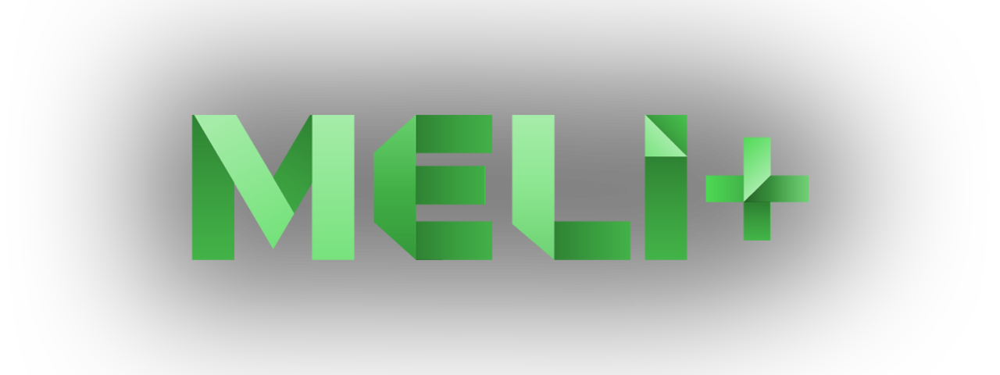

<h1 align="center">
    Meli Plus - Emails
</h1>

<h4 align="center">
    Repository of email templates of <a href="https://meli-plus.vercel.app/">Meli+</a> streaming platform.
</h4>

    <a href="#----summary">Summary</a> •
    <a href="#----technology-stack">Technology Stack</a> •
    <a href="#----related">Related</a>
    <a href="#----license">License</a> •
    <a href="#----contact">Contact</a>

    

    <strong>Meli+ isn't an official product of <a href="https://mercadolibre.com/">Mercado Libre</a> ecosystem</strong>

<h2>
    Summary
</h2>

    [TODO]

<h2>
    Technology Stack
</h2>

    [TODO]

<h2>
    Related
</h2>

    <ul>
        <li>
            <a href="https://github.com/hozlucas28/Meli-Plus" target="_blank">Source code of Meli+</a>
        </li>
    </ul>

<h2>
    License
</h2>

    This repository is under <a href="./LICENSE" target="_blank">GNU AGPLv3</a>, if you want to see what you are allowed to do with the content of this repository, please visit <a href="https://choosealicense.com/licenses/" target="_blank">choosealicense</a> for more information.

<h2>
    Contact
</h1>

    If you want to contact me, please see my <a href="https://github.com/hozlucas28" target="_blank">socials medias</a> in my GitHub profile.

